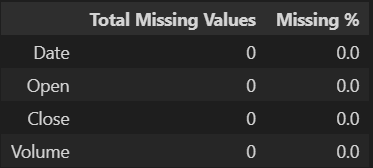
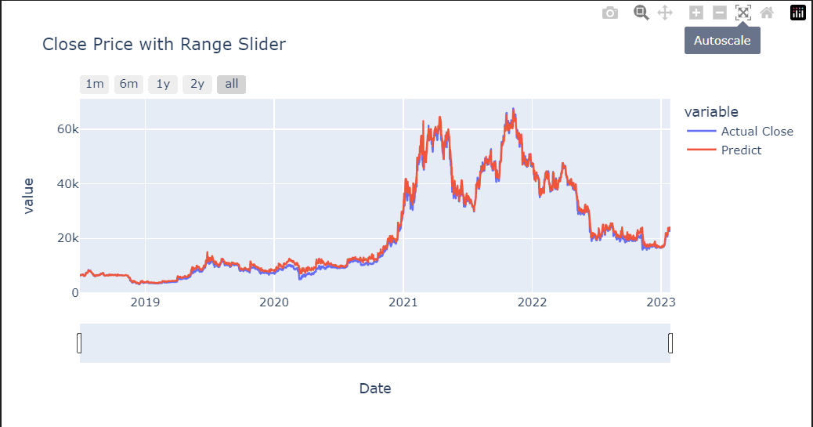

# Group Project 2 (Robel, Greg, Kyle)

## Project Overview

Our primary objective of the project was to create a machine learning model that effectively predicted the value of bitcoin using a couple different machine learning libraries not previously covered in class.  

(Historical price)

First, we imported a number of different libraries and attempted to use XGBoost. Early on we ran into challenges when trying to complete the xgb.XGBRegressor() command. However, after some additional research we were able to move past that error and copmlete the model and fit component of the process. Once that was completed, we applied the details we had to calculate the mean squared error, the root mean squared error, and the r-squared. Although we did not move beyond these calculations for XGBoost, it did provide a good comparison for our alternative model, the Kernel Ridge Regression. 

The Kernel Ridge Regression model we applied worked a bit better than XGBoost, and we were able to complete both the necessary performance calculations and develop predicted bitcoin prices to directly compare to actuals. 

## Data Gathering

We used the yfinance import to pull Bitcoin performance beginning the 1st of December, 2017. In addition to the Open, High, Low, Close, and Volume details, we also created some additional features including: 

-Percent Change 
-Exponential Weighted Moving Average 
-Simple Moving Average: We did use several different time periods (5, 10, 15, and 30). 

Initially, we had some challenge reading in the date details with yfinance, but adding the '1d' interval appeared to standardize and solve that issue. 

## Overview of Models Used

### Kernel Ridge Regression

The Kernel Ridge Reression has the ability to use different kernel types. In our case, we used a linear kernel and an alpha of 5,000. 

### XGBoost

We did not complete the XGBoost completely. We ran the model, fit and predicted values. The challenging part with this library is the number of parameters that need to be tuned. In some cases we weren't very clear on what a given parameter was actually tweaking. The step we did not complete was pasting the predicted values against actual and looking at the difference.

## Developing and Running the Models

### Kernel Ridge Regression

To setup the Kernel Ridge Regression model we need to properly define the training and testing parameters. We first used the standard test_size indicator as a precentage, but that created challenges later on attributing the predicted values back to the corresponding date. Instead, we specifically defined the time period and the offset we wanted to use to end the training period. This proved far more useful. 

### XGBoost

Prior to running the library, we confirmed that the imported data did not include any null values. Not surprisingly given the data source, no null values were imported. Then, we dropped both the Open and Volume features from the dataset, leaving us with just the Date and Close price. 

Once we had our cleaned dataset, we developed rolling windows at 3, 7, and 30 day windows and calculated the mean. Following this step, we did shift the dataset to account for the rolling windows and the associated null values. 

Once we established the rolling day features, we split the training and validation data. The training data using nearly 70%, while the remaining data was used for validation. Once we split the data, we ran xgb.XGBRegressor and applied the following parameters: 

-Learning Rate 
-Max Depth 
-Estimators 
-Min Child Weight 
-Gamma 
-Subsample 
-Sample by Tree 
-Sample by Level 

## Model Evaluation

### Kernel Ridge Regression

After applying the model, fit, predict structure we were given an array and that array is what was then used to compare predictions against actual. The initial process using Kernel Ridge was relatively straightforward in comparison to XGBoost. The performance of the train and test data is as follows: 

    Train MAE: 134.66
    Train RMSE: 187.08
    Train R2: .99

    Test MAE: 818.07
    Test RMSE: 1135.80
    Test R2: 1.00

 

### XGBoost

Once we setup the parameters, we ran model.fit on the training dataset and then the following step was to use model.best*estimator*. Following those steps we calculated the mean absolute error, the root mean squared error and the correlation coefficient (r-sqaured) for both the training and test data. 

    Train MAE: 127.85
    Train RMSE: 194.35
    Train R2: .99

    Test MAE: 2380.03
    Test RMSE: 2994.37
    Test R2: .95

 

## Model Comparison

The Kernel Ridge Regression model appeared to have a more accurate prediction compared to the XGBoost model. That is based on the lower MAE and RMSE using the Kernel Ridge model. We suspect that as the number and complexity of features increases, the XGBoost model becomes more value and the Kernel Ridge Regression may not be the most effective. 

## Project Challenges

We had two primary challenges. The first, early on, was getting the XGBoost library to properly function. This was in part due to indexing the date values, but beyond that it was correctly assigning the parameters. 

Additionally, we had issues properly forecasting performance with the Kernel Ridge Regression analysis. The issue was that we were trying to forecast 30 days into the future, but understandably did not have the features to properly forecast out that far in advance. 

## Responding to Challenges

We spent an awful lot of time trying to resolve our difficulties with forecasting into the future with Kernel Ridge. As a result, we spent minimal time trying better understand the parameters of XGBoost and the finer details of how it functioned. In the future, it would be helpful to understand that model in more detail so that it can be used more effectvely. 

Our Kernel Ridge Regression challenges were self-imposed. We spent a lot of time trying to make a 30-day forecast work when we didn't have variables that looked that far into the future. If we had more time, we would have used FBProphet or another forecasting tool to understand potential growth or decline beyond the data we had readily available. In addition, we could have gone into more detail regarding trading signals and made buy/sell recommendations with the predictions that were given.
